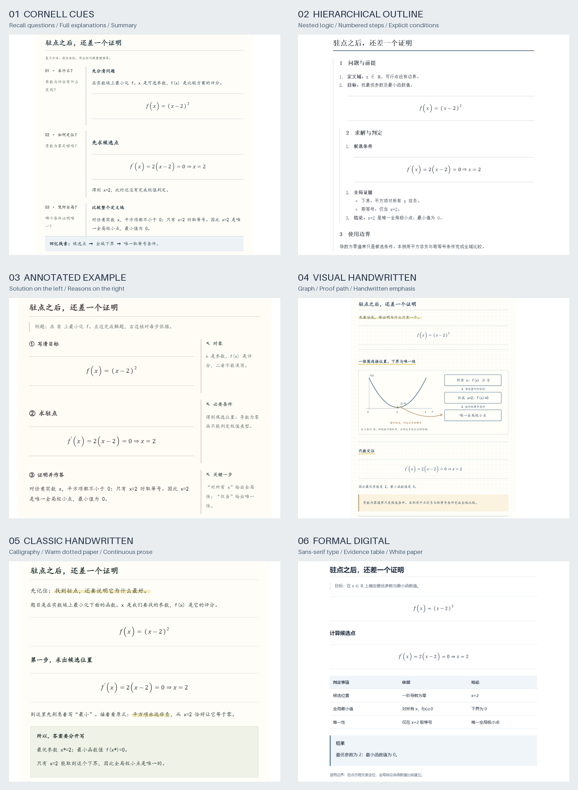

# Chat to Notes Skill

[简体中文](README.md) · [Usage](docs/usage.md) · [FAQ](docs/faq.md) · [Validation](docs/validation.md)

[](https://github.com/haoran3160-afk/chat_to_notes-skill/actions/workflows/checks.yml)
[](LICENSE)

**Turn Codex conversations, ChatGPT chats, and other readable chat transcripts into structured study notes.** Choose one of six styles before generation, review a fixed-style HTML document, then export the approved version to PDF with internal navigation and bookmarks.

This repository contains a Codex Skill, HTML templates, and local Python helpers. It supports mathematical derivations, worked code examples, study material, and technical discussions. Slides are optional. It adds no browser extension, backend service, or separate model API; authoring still uses the model and quota of the host agent.



The overview focuses on characteristic body excerpts and omits shared headers and navigation. All six explain the same synthetic math problem through different reading structures. Click a style below for its full-page screenshot.

## Install and use

Ask Codex:

```text
Use $skill-installer to install skills/chat-to-notes from
https://github.com/haoran3160-afk/chat_to_notes-skill.
```

Then:

```text
Use $chat-to-notes to turn our current conversation into study notes.
Let me choose a style first. Deliver HTML for review before exporting PDF.
Write the notes in English.
```

You may also supply an accessible task/chat reference or a transcript export. Access depends on the tools and permissions available in the current agent session. The Skill does not promise universal access to private conversations. The maintained Skill instructions currently use Chinese; you can request the output language explicitly.

See [Usage](docs/usage.md) for manual installation, dependencies, CLI commands, and reproducible examples.

## Six fixed styles

| Style | ID | Intended use |
|---|---|---|
| [Cornell cues](docs/images/cornell.png) | `cornell` | Three recall prompts aligned with explanations and a summary |
| [Hierarchical outline](docs/images/outline.png) | `outline` | Nested and numbered prerequisites, steps, and proof evidence |
| [Annotated worked examples](docs/images/annotated.png) | `annotated` | Each solution step aligned with its conditions and justification |
| [Visual handwritten](docs/images/sketch.png) | `sketch` | A graph connected to the proof path on graph paper |
| [Classic handwritten](docs/images/handwritten.png) | `handwritten` | Calligraphic prose, dotted warm paper, highlighted reasoning |
| [Formal digital](docs/images/electronic.png) | `electronic` | Sans-serif type, white paper, and an evidence/comparison table |

The style is selected before authoring and stays fixed from HTML to PDF. Changing it creates a new document for review. There is no runtime theme switch. Local fonts affect appearance; typography is not pixel-identical across operating systems.

## What is preserved

- Definitions, prerequisites, important reasoning steps, examples, and limitations.
- A working coverage inventory that separates substantive explanation from name-dropping.
- Static MathML, embedded images and diagrams, and expanded practice answers in print.
- The approved HTML hash and selected style during PDF export.
- Source gaps and truncation disclosures instead of invented completeness.

The workflow organizes material into relationships, explanations, worked examples, and retrieval practice when appropriate. Non-learning conversations retain their topics, evidence, conclusions, and open questions without forced exercises.

## Local demonstration

Python 3.10+ is required. HTML assembly uses the standard library. PDF export additionally uses local Chrome/Edge/Chromium, PyMuPDF, and websocket-client.

```bash
python examples/build_demo.py --style electronic --output-dir outputs/demo
```

This creates HTML from an independently authored synthetic example; no account or private transcript is read. Public preview images use the actual Skill renderer. See [reproduction instructions](docs/usage.md#reproduce-previews).

## Layout and limits

Installable resources live in [`skills/chat-to-notes/`](skills/chat-to-notes/SKILL.md). Repository-level documentation, examples, and tests are kept separate so they need not enter the model's Skill context.

Mechanical checks cannot certify mathematical correctness or explanation quality. Goodnotes import has not been tested on a real device. See [Validation](docs/validation.md) for evidence and remaining limits.

Maintained by [haoran3160-afk](https://github.com/haoran3160-afk). Contributions: [CONTRIBUTING.md](CONTRIBUTING.md). Security: [SECURITY.md](SECURITY.md). Original project code and documentation are [MIT licensed](LICENSE); third-party dependencies retain their own licenses.
